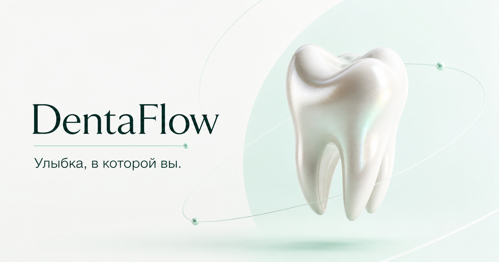

# DentaFlow

Портфолио-проект современной стоматологии: светлый лендинг с WebGL-сценой, форма записи и отдельная веб-панель для обработки заявок.



## Возможности

- адаптивный React-интерфейс;
- интерактивная WebGL-модель;
- форма записи с серверной валидацией;
- хранение заявок в Cloudflare D1;
- защищённая паролем веб-админка;
- статическая публикация интерфейса на GitHub Pages;
- backend на Cloudflare Workers.

## Стек

`React 19` · `TypeScript` · `Node.js` · `Vinext` · `Cloudflare Workers` · `D1` · `WebGL`

## Локальный запуск

```bash
npm install
cp .env.example .env.local
npm run dev
```

- сайт: `http://localhost:3000`
- админка: `http://localhost:3000/admin`

Для backend задайте `ADMIN_PASSWORD`. Для отдельной статической сборки укажите `VITE_API_BASE`.

```bash
npm run build
npm run build:pages
```

## Публикация

GitHub Actions автоматически публикует сайт после отправки изменений в `main`.

- сайт: `https://sodex00.github.io/dentaflow/`
- админка: `https://sodex00.github.io/dentaflow/admin`

Backend развёрнут отдельно, поскольку GitHub Pages не запускает серверный код и базы данных.

## Структура

```text
app/                     React-интерфейс и API
app/admin/               веб-панель администратора
app/api/requests/        приём заявок
app/api/admin/requests/  защищённое управление заявками
github-pages/            точки входа статической версии
db/ и drizzle/           схема и миграции D1
worker/                   Cloudflare Worker
```
